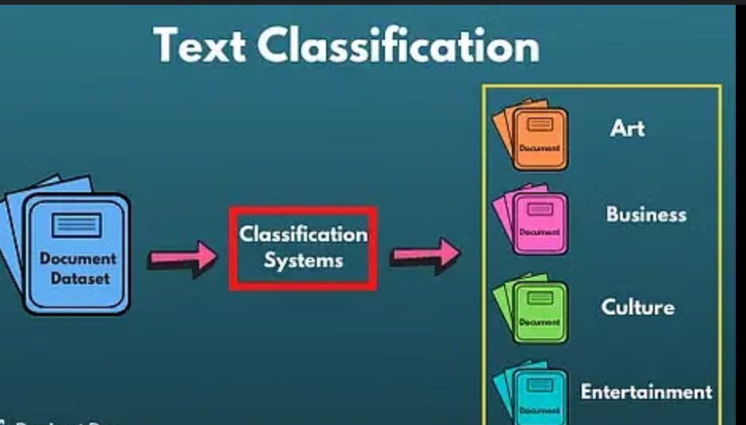

# Text_Classification_using_NLP

  

# 🧠 Text_Classification_using_NLP

This project involves building a multi-class text classification model that categorizes noisy and unlabeled sentences into predefined categories using natural language processing (NLP) techniques.

---

## 📌 Objective

To classify input sentences into one of the following 10 categories:
- **Education**
- **Ecommerce**
- **Technology**
- **Healthcare**
- **Entertainment**
- **Finance**
- **News**
- **Travel**
- **Sports**
- **Other**

---

## 🗂️ Dataset

- Contains 90,507 raw sentences.
- Sentences may include URLs, emojis, slang, and inconsistent casing.
- Initial dataset is **unlabeled** — labeling is done via **rule-based keyword matching**.

---

## 🧰 Tools & Libraries Used

- **Python**
- **Pandas** – Data manipulation
- **Scikit-learn** – TF-IDF, classifiers, metrics
- **Imbalanced-learn (SMOTE)** – For handling class imbalance
- **Matplotlib** – Visualization
- **Joblib** – Saving models and vectorizers

---

## 🧹 Data Preprocessing

- Converted all text to lowercase
- Removed URLs, emojis, special characters, and extra spaces
- Created custom function for cleaning
- Applied rule-based labeling based on keyword occurrences

---

## 🔎 Class Distribution

Class imbalance observed with a dominant "Other" category. SMOTE was applied to balance classes during training.

---

## ✨ Feature Engineering

- **TF-IDF Vectorization** with max 10,000 features used to convert text to numeric form

---

## 🧠 Models Trained

| Model               | Accuracy | Weighted F1 Score |
|--------------------|----------|--------------------|
| Logistic Regression| 82.23%   | 83.09%             |
| Linear SVM         | **83.65%** | **84.57%**           |
| Random Forest      | 73.14%   | 72.28%             |

---

## 📊 Evaluation Metrics

- **Accuracy**
- **Weighted F1 Score**
- **Classification Report** (Precision, Recall, F1-score for each class)

---

## 🧪 Sample Predictions

10 test samples were classified using the trained model to demonstrate real-world predictions.

---

## 💾 Model Artifacts

The following files are saved for reuse and deployment:
- `text_classifier.pkl` – Trained model
- `vectorizer.pkl` – TF-IDF vectorizer

---

## 📁 Project Structure
├── Task_2_Text_Classification_using_NLP.ipynb # Complete training and evaluation notebook

├── Task2_Prediction_test.ipynb # Test sample prediction demo

├── Task 2 - Text Classification using NLP - Colab.pdf

├── class.png # Category distribution chart

├── text_classifier.pkl # Saved classifier

├── vectorizer.pkl # Saved vectorizer

└── README.md # Project documentation
